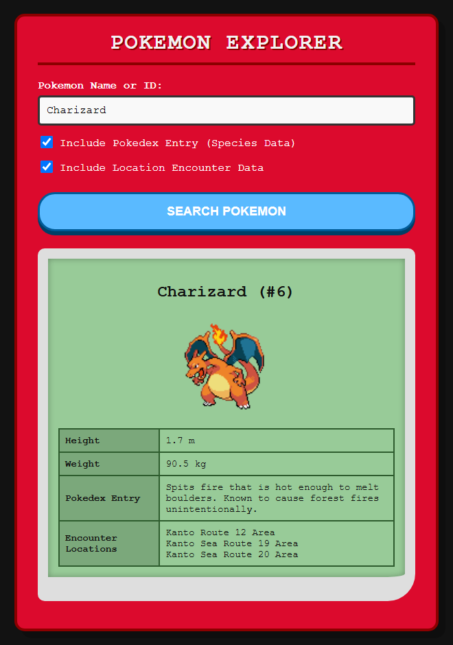
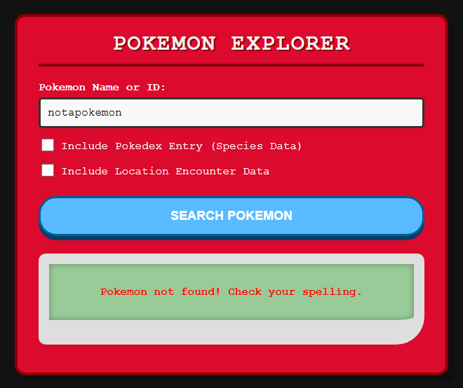

# Pokédex

McMaster University **4WP3** (Web Programming) assignment. A small Express app that looks up any
Pokémon through [PokéAPI](https://pokeapi.co/).

<p>
  
  
</p>

## Features

- The front end sends the search to an Express route with `fetch`; the server calls PokéAPI with axios
- Shows the Pokémon's sprite, number, height and weight
- Optional: the first English Pokédex entry (species endpoint)
- Optional: up to three wild encounter locations
- Clear error message when a Pokémon doesn't exist

## Tech

Node.js, Express, axios, HTML/CSS/JavaScript

## Run

```bash
npm install
node server.js
```

Then open http://localhost:3000/app.
